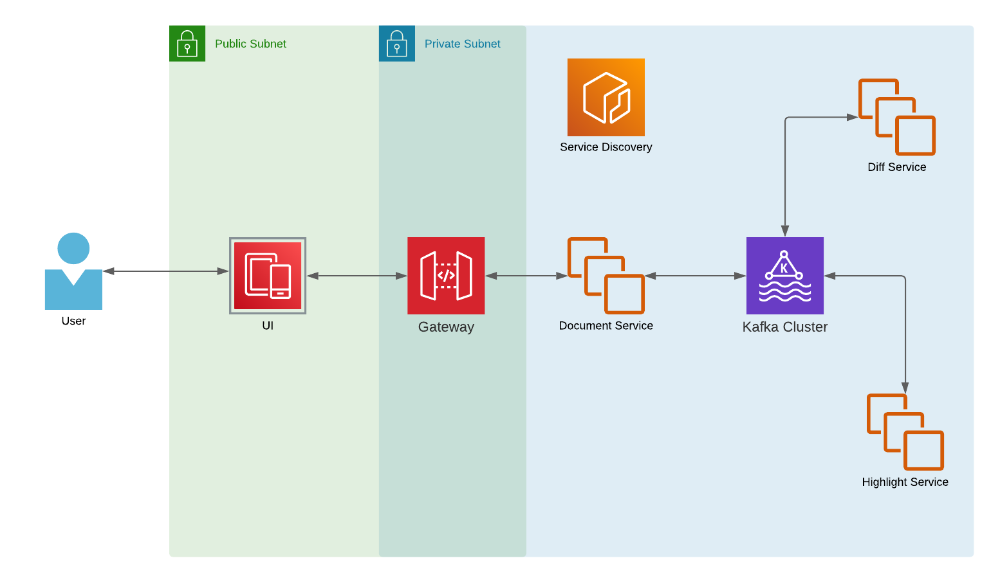

# Docs Diff

---

The Web app allows users to compare two documents at once, highlighting any textual differences between
the two.

## Architecture

## Services

1. Discovery Service - The service registry.
2. Gateway Service - API Gateway.
3. Config Server - Centralize external config.
4. Compare Service - Composite service to compare 2 documents.
5. Diff Service - Extract differences between the texts.
6. Highlight Service - Highlight the differences between the texts.

> TODO: UI Service

## Requirements

For building and running the application you need:

- [JDK 1.8](http://www.oracle.com/technetwork/java/javase/downloads/jdk8-downloads-2133151.html)
- [Maven 3](https://maven.apache.org)

